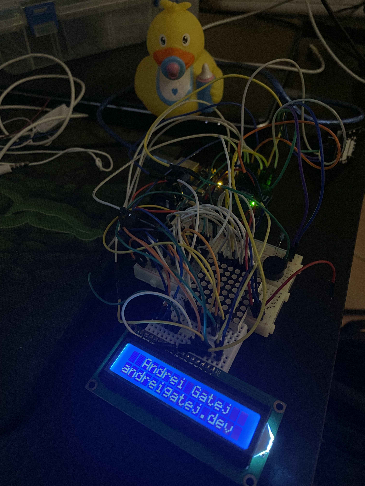

# Arduino Snake Game

*[Other repo](https://github.com/Andrei0872/IntroductionToRobotics) with robotics homework*.

- [Arduino Snake Game](#arduino-snake-game)
  - [Task requirements](#task-requirements)
  - [Picture of the set-up](#picture-of-the-set-up)
  - [Link to the video](#link-to-the-video)
  - [Used components](#used-components)
  - [Interesting Challenges](#interesting-challenges)
    - [The Snake Game](#the-snake-game)
    - [Working with pointers](#working-with-pointers)
    - [Writing reusable and reliable code](#writing-reusable-and-reliable-code)

## Task requirements

* basic sounds when eating, when navigating through the menu, when the game is over, etc.
* difficulty levels
* the option to customize settings(e.g. LCD contrast/brightness, sounds enabled or not) and save the settings
* highscore board which will be updated accordingly

---

## Picture of the set-up

<div style="text-align: center;">
  
</div>

## Link to the video

The video showcasing the functionality can be found [here](https://youtu.be/osQ7XLqH9wk).

---

## Used components

* LCD
* a joystick
* a buzzer
* led matrix
* shift register

---

## Interesting Challenges

### The Snake Game

Although it's a simple game, there were a few challenges when it came to its implementation. The building blocks are the following:

```c
enum Directions {
  LEFT = 0,
  RIGHT = 1,
  UP = 2,
  DOWN = 3,
};

Position* snakeDots[MATRIX_SIZE * MATRIX_SIZE];
int snakeDotsCount = 0;
Directions turningPoints[MATRIX_SIZE][MATRIX_SIZE];
```

`turningPoints` will keep track of the **current direction** of each snake dot. A snake, especially if it is comprised of multiple points, it can turn many times. Finding out the direction of each point can be achieved by using `turningPoints[x][y]`.

Part of the reason as to why `turningPoints` is needed is that the snake will continuously move in one certain direction, once the game has started. However, not all of the snake's dots will follow the same direction, mainly because the snake will most likely turn a few times. So, we must take into account the turning points as well when the snake is moving.

Before determining the next position on the matrix of each snake dot, `applyTurningPoints()` is called:

```c
void applyTurningPoints () {
  for (int i = 0; i < snakeDotsCount; i++) {
    Position& pos = *snakeDots[i];
    
    int newDirection = turningPoints[pos.row][pos.col];
    if (newDirection != -1) {
      pos.crtDirection = newDirection;

      // If the tail reached this point, then we can no longer consider this turning point.
      if (i == snakeDotsCount - 1) {
        turningPoints[pos.row][pos.col] = -1;
      }
    }
  }
}
```

### Working with pointers

The concept of pointers never seemed daunting to me, but I could never understand them properly. I'm very glad that, after completing this project, I feel more comfortable working pointers.

I feel proud of being able to utilize such syntax:

```c
Position* snakeDots[MATRIX_SIZE * MATRIX_SIZE];

/* ... */

Position& pos = *snakeDots[i];
```

### Writing reusable and reliable code